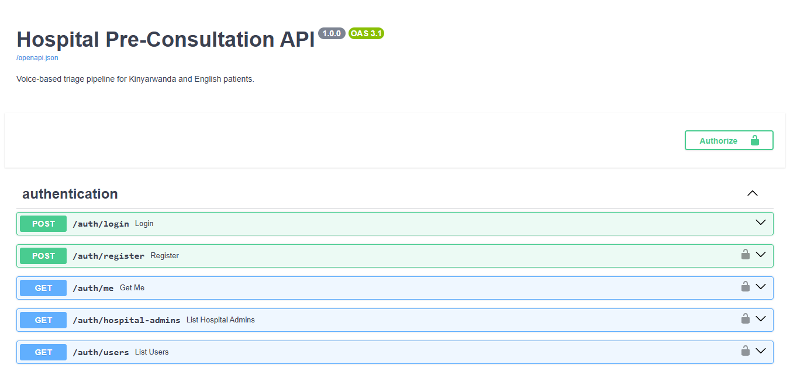

# Pre-Consultation Agent

For component specific details, see:

- [Backend README](backend/README.md)
- [Frontend README](frontend/README.md)

## Overview

Eleza is a faster way to talk to our doctors. This project is a preconsultationa gent which is hospital-owned and voice-based system that helps collect patient information before a doctor consultation.

It supports Kinyarwanda and English, asks follow-up questions to clarify symptoms, and provides structured outputs for clinical review.

This is a supervised support tool, not a diagnosis system.

## Project Description

The project combines:

- A FastAPI backend for voice processing, session flow, triage logic, and clinician-facing endpoints.
- A Flutter frontend for kiosk/patient interaction and doctor review workflows.
- Testing scripts and notebooks to validate model behavior and system integration.

Expected value:

- Reduce time spent in first-level intake.
- Improve symptom capture quality before consultation.
- Help doctors quickly review patient summaries and suggested next actions.

## Demo And Deployment Links

- Demo video: [Link to demo video](https://drive.google.com/drive/folders/1eRBl3uKAhTo8PucomjlGDkXwoBHeUNrZ?usp=sharing)
- Deployed frontend: [Link to flutter APK file](https://drive.google.com/drive/folders/1_HDb-CJvF1riBDUhP5I5dgTGcu4zviLh?usp=sharing)
- Deployed backend/API: [Link to backend ](https://boisterously-implicatory-anderson.ngrok-free.dev/docs)
- Deployed database: [Link to Render database](https://dashboard.render.com/d/dpg-d6ol7qkr85hc739hdvog-a)

## Quick Setup (Backend + Frontend)

### Prerequisites

- Python 3.10+
- Flutter SDK (stable)
- PostgreSQL (for full backend database features)

### 1) Create And Activate Virtual Environment (Backend)

From the project root:

Windows PowerShell:

```powershell
python -m venv venv
.\venv\Scripts\Activate.ps1
```

macOS/Linux:

```bash
python3 -m venv venv
source venv/bin/activate
```

Deactivate when done:

```bash
deactivate
```

### 2) Backend Setup

```bash
cd backend
pip install -r requirements.txt
```

Create a `.env` in `backend/` (use `backend/.env.example` as a template).

Database setup (if using PostgreSQL locally):

```bash
createdb pre_consultation_db
psql -U postgres -d pre_consultation_db -f database/schema.sql
```

Run API:

```bash
uvicorn main:app --reload --port 8000
```

Useful endpoints after start:

- API docs (Swagger UI): `http://localhost:8000/docs`
- Startup status: `http://localhost:8000/startup/status`
- Health check: `http://localhost:8000/health`

### 3) Frontend Setup

In a separate terminal:

```bash
cd frontend
flutter pub get
```

Run frontend (choose one):

```bash
flutter run -d chrome
flutter run -d windows
flutter run -d android
```

You can also run on:

- iOS simulator/device (macOS only)
- Android emulator
- Physical Android/iOS device

## Testing Guide

Use any of the following depending on what you want to validate.

### Backend Testing Alternatives

1. Swagger UI (manual endpoint testing)

- Start backend and open `http://localhost:8000/docs`.
- Test endpoints interactively with request/response visibility.

2. Integration script

```bash
python backend/test_new_system_integration.py
```

3. Database verification script

```bash
python testing/test_database.py
```

4. Whisper/model loading and transcription check

```bash
python backend/test_whisper.py <path_to_audio.wav>
```

5. Audio format compatibility test

```bash
python testing/test_audio_formats.py <path_to_audio_file>
```

6. Conversation CLI script (legacy/manual flow simulation)

```bash
python testing/testconversation.py
```

Note: this script targets conversation endpoints that may differ from the current router contract. Use Swagger UI first if you want the most reliable manual API validation path.

7. Notebook-based testing

- `backend/kaggle-test.ipynb`
- `backend/colab-test.ipynb`
- Model notebooks in `notebooks/` for focused experimentation per model.

### Frontend Testing Alternatives

1. Run on web:

```bash
cd frontend
flutter run -d chrome
```

2. Run on Windows desktop:

```bash
cd frontend
flutter run -d windows
```

3. Run on emulator/device:

```bash
cd frontend
flutter run -d android
```

4. Run widget tests:

```bash
cd frontend
flutter test
```

5. Static checks:

```bash
cd frontend
flutter analyze
```

## Results Summary

Current achieved results:

- A patient can speak to the system and receive tailored follow-up questions for clarification.
- The system provides next-step guidance without issuing a medical diagnosis.
- The system forwards structured patient information and symptoms for doctor review.
- Doctors can review patient cases and assign examinations or next actions.

Current gap against intended objective:

- A planned breathing-pattern emergency escalation feature (detect respiratory distress from speech/audio and escalate immediately) is not yet implemented.

## Analysis

Detailed analysis of the results and how they achieved or missed the objectives in the project proposal with the supervisor.

The project achieved key functional objectives for supervised pre-consultation intake: multilingual patient interaction (Kinyarwanda and English), iterative clarification, safe non-diagnostic guidance, and doctor-facing case summaries. These outcomes align with the objective of reducing intake friction while preserving clinician decision authority.

Afterdiscussin, the system direct the patient to a particular area as necessary or escalates to emergency if necessary. Finally, The doctor can also view each patient's case and assign them necessary examinations or other next steps.

However, one high-impact objective remains incomplete: automatic breathing/emergency detection directly from patient speech. Because this feature was not completed, emergency detection is currently dependent on existing symptom and red-flag logic rather than dedicated respiratory signal analysis. This leaves an important safety enhancement for future implementation.

## Discussion

A detailed discussion on the importance of the milestones and the impact of the results with the supervisor.

Key milestone impact:

- Voice capture and transcription enabled practical patient interaction in supported languages.
- Clarification question flow improved symptom detail quality before clinician review.
- Structured handoff to doctors reduced information loss between intake and consultation.
- Doctor-side review and action assignment supports real clinical workflow continuity.

Together, these milestones show that the system can function as a meaningful pre-consultation layer in hospital settings, especially where intake bottlenecks are common.

## Recommendations

Next steps:

- Implement respiratory distress detection from speech/audio to support immediate emergency escalation.
- Add stronger validation in real hospital pilot environments with clinician feedback loops.
- Expand multilingual robustness and accents handling.
- Add more preset symptoms so the system has a fallback and doesn't always call the models.
- Strengthen deployment hardening (security, privacy controls, auditability, and observability).

Community application guidance:

- Use the tool as supervised pre-consultation support, never as standalone diagnosis.
- Keep clinicians in the decision loop for all medical decisions.
- Pair technical rollout with user training for hospital staff and patient facilitators.

## Repository Structure Overview

This repository is organized as follows (see each folder's README for details):

pre-consultation-agent/
├── backend/
│ ├── main.py
│ ├── requirements.txt
│ ├── routers/
│ │ ├── auth.py
│ │ ├── dialogue.py
│ │ ├── doctor.py
│ │ └── ...
│ ├── database/
│ │ ├── database.py
│ │ ├── schema.sql
│ │ └── migrations/
│ ├── utils/
│ │ └── email_service.py
│ └── models/
│ └── ...
├── frontend/
│ ├── pubspec.yaml
│ ├── lib/
│ │ ├── main.dart
│ │ ├── screens/
│ │ ├── components/
│ │ ├── models/
│ │ └── services/
│ ├── assets/
│ └── test/
├── notebooks/
├── testing/
├── Datasets/
├── Assests/
├── README.md
└── fly.toml

## Testing images:

Frontend (Flutter Web):


Backend:

Kaggle:


Swagger UI:


